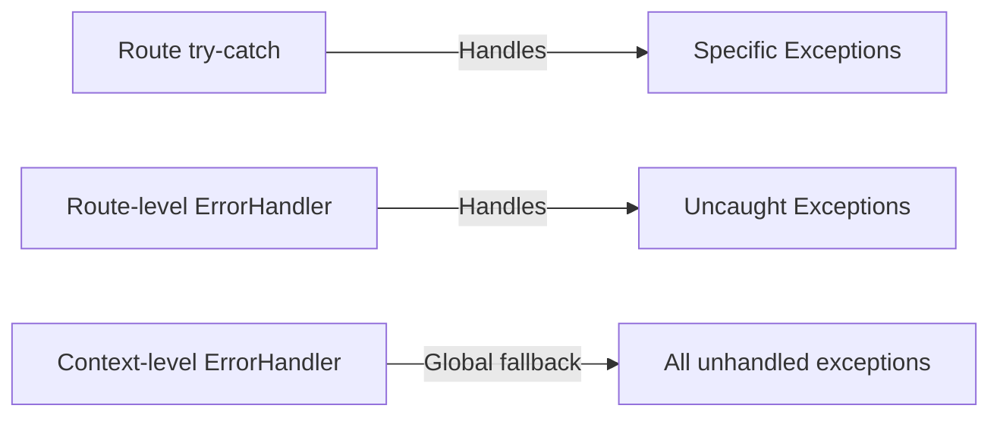

# Apache Camel Try-Catch-Finally: Comprehensive Guide

## 1. Fundamental Concept
Apache Camel's `doTry()/doCatch()/doFinally()` provides **route-level exception handling** similar to Java's try-catch-finally, but operates on the **EIP (Enterprise Integration Patterns) layer**. It intercepts exceptions during message processing and manages error flows within routes while maintaining message continuity.

---

## 2. Execution Flow

### Try Block (`doTry()`)
- Defines the *protected section* where exceptions might occur
- Processes messages normally until:
    - Successful completion, **OR**
    - An exception is thrown by any component/processor
- On exception: Immediately exits the try block and searches for matching `doCatch()`

### Catch Block (`doCatch()`)
- Exception-type based routing (e.g., `IOException.class`)
- **First-match principle**: Checks catch blocks in declared order
- Has access to exception context via:
    - `${exception}`: Full exception object
    - `${exception.message}`: Exception message
    - `${exception.stacktrace}`: Stack trace
- Can modify messages, headers, or body (e.g., set error messages)
- *Does NOT terminate route execution* – processing continues after the block

### Finally Block (`doFinally()`)
- **Guaranteed execution** regardless of success/error
- Runs after:
    - Successful try block completion, **OR**
    - After any executed catch block
- *No access to exception details* – designed for neutral cleanup tasks
- Executes even if catch blocks rethrow exceptions  
---
## 3. Scope Boundaries
- **Route-Centric**: Affects only the current route's processing
- **Message Preservation**:
    - Original message is preserved when entering try block
    - Modifications in try/catch blocks propagate to subsequent steps
- **Context Isolation**: Exception context is only available within catch blocks

---

## 4. Interaction with Camel's Error Handlers

- Uncaught exceptions bubble up to:
    - Route-scoped error handler (e.g., onException())
    - Context-scoped error handler (e.g., Dead Letter Channel)

---

## 5. Essential Behavioral Properties

### Non-Transactional Nature
- **No Automatic Rollback**:
    - Does NOT provide implicit transaction rollback capabilities
    - Requires explicit transaction managers for atomic operations
- **Deterministic Cleanup**:
    - `doFinally()` block executes unconditionally
    - Cleanup occurs regardless of transaction commit/rollback status
    - Suitable for non-transactional resources (e.g., file handles, network connections)

### Synchronous Execution Model
- **Thread Continuity**:
    - Entire try-catch-finally flow executes in the original thread
    - No thread handoffs occur during exception handling
- **Asynchronous Limitation**:
    - Requires explicit async routing (SEDA/Threads) for background processing
    - Blocking operations in any block stall the entire route

### Pipeline Integrity Guarantees
- **Final Block Priority**:
    - `doFinally()` ALWAYS executes before exiting error scope
    - Runs even if catch blocks throw new exceptions
- **Controlled Continuation**:
    - Post-try processing continues normally after `end()`
    - Explicit `.stop()`, `.end()`, or exception required to terminate flow
- **State Preservation**:
    - Modifications in try/catch persist through finally block
    - Finally executes with last message version before error

---

## 6. Use Case Patterns
- **Graceful Failure**: Convert exceptions to error messages
- **Resource Cleanup**: Close files/connections in `doFinally()`
- **Compensating Actions**:
    - Try: Business operation
    - Catch: Compensation logic
    - Finally: Audit logging
- **Exception Wrapping**: Catch low-level exceptions, throw domain-specific ones

---

## 7. Anti-Patterns to Avoid
- **Over-nesting**: Deeply nested try-catch blocks reduce readability
- **Catch-All Abuse**: Generic `Exception.class` can mask problems
- **State Mutation in Finally**: Risk of overriding error messages
- **Long-Running Operations**: Blocking code in finally can stall routes

---

## 8. Under the Hood
When an exception occurs:
1. Camel's pipeline processor detects the failure
2. Suspends current processing and walks the try-catch-finally chain
3. Builds error context with exception details
4. Executes matched catch with error context
5. Runs finally block with original message
6. Resumes pipeline after end() tag

---
This design provides deterministic error handling while maintaining Camel's core principle of message-driven processing continuity.
